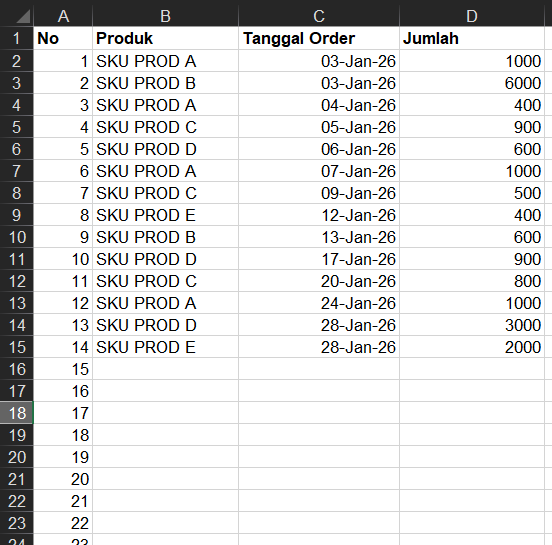
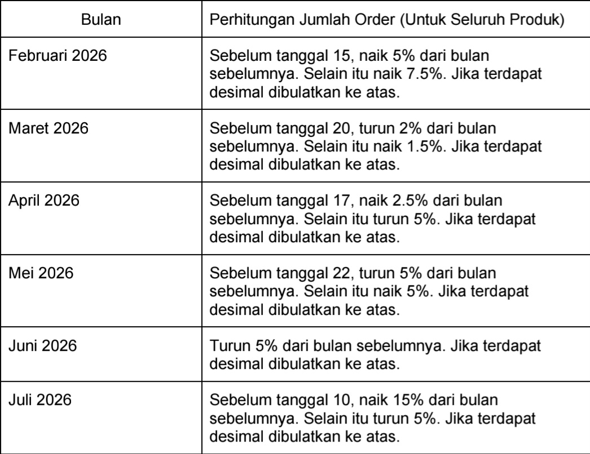
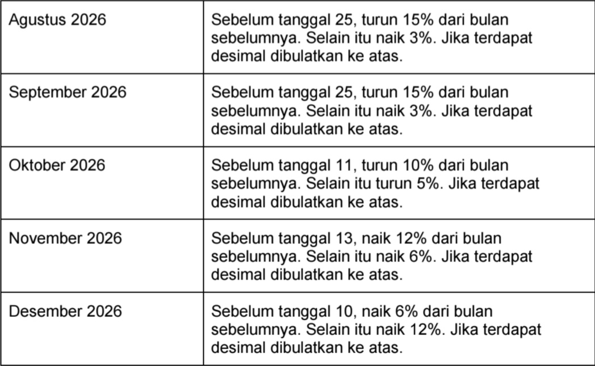
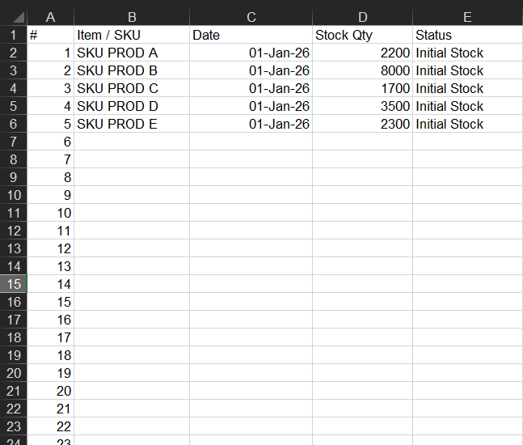
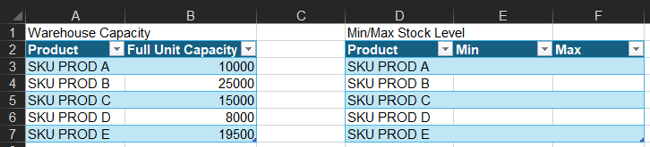
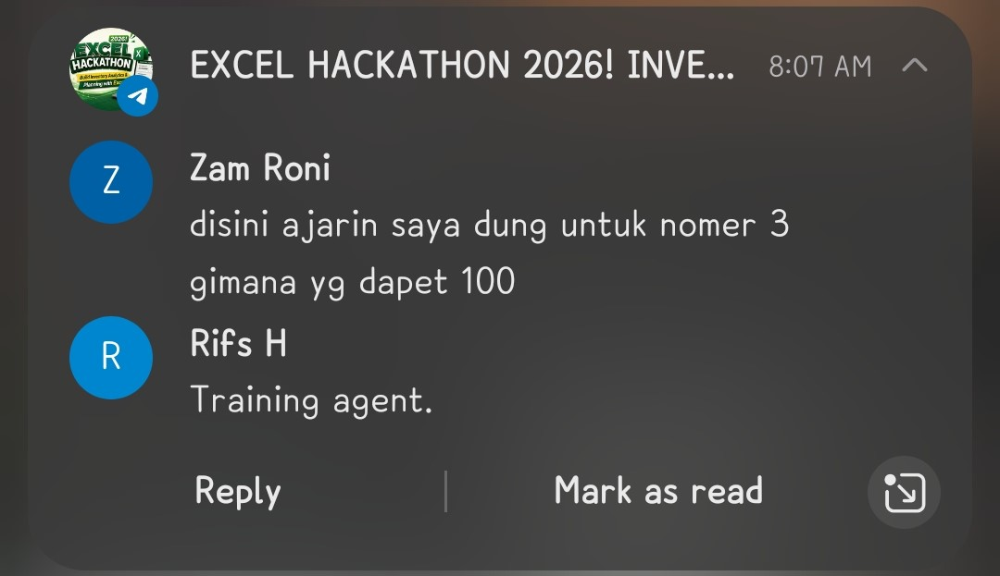

# hackathon-excel-dqlab-2026

## Pre Thoughts
Tujuan ikutan hackathon ini:
- Mencicip dunia supply chain, inventory stock. 
- Me-refresh skill excel. 
- Upaya menambah kompetensi untuk peluang opportunity yang akan datang. 

Plan alur berpikir buat nyelesaiin hackathon ini:
- Baca dan pahami pdf task hackathon nya. 
- Pikirkan dulu solusinya secara mandiri sebelum melibatkan AI. 
- Setelah dapat raw sketch dan big picture nya, berangkat ke AI, ngobrol. 
- Aplikasikan rumus excel hasil rundingan dengan AI. 
- Submit.

My subjective random thoughts during hackathon:
- Mengingat rule yang membebaskan peserta untuk menggunakan AI, maka melihat leaderboard jadi kurang apple-to-apple dijadikan tolok ukur untuk membandingkan progres diri buatku. Terlebih saat ini aku lebih memprioritaskan pematangan konsep secara keseluruhan terlebih dahulu, baru kemudian mengejar kecepatan pengerjaan.
- Yang oleh karenanya, leaderboard di hackathon kali ini sejatinya kebanyakannya lebih berfungsi sebagai pembanding seberapa bagus prompt dan seberapa cepat AI yang digunakan peserta. Saat ini aku belum dalam kondisi seperti itu, masih dalam fase memahami dan memaknai.
- Jadi di hackathon ini, fokusnya lebih ke mindset kalau di sini aku berkompetisi terhadap diriku sendiri, dengan caraku sendiri, dengan pace ku sendiri. 

## Hackathon Overview

Raw data: 

- **sheet `Demand Projection`:**        
Keterangan:

    - Ini sheet untuk melakukan proyeksi jumlah permintaan di setiap tanggal yang sama seperti data sebelumnya, untuk setiap bulan sampai Desember 2026. 
    - Produknya ada 5 jenis: SKU PROD A, B, C, D, E.
    - Task nya mengisi proyeksi jumlah permintaan di bulan selanjutnya untuk tanggal yang sama seperti bulan sebelumnya, mengikuti rule proyeksi yang ditentukan di instruksi.
    - Rule proyeksinya: 
    
      
    - Nantinya sheet ini akan digunakan sebagai basis perhitungan stok minimal dan maksimal yang mungkin di gudang untuk masing-masing SKU, di sheet Capacity. 
    - Yang mana, dari situ juga akan digunakan sebagai basis perhitungan untuk penentuan tanggal reorder produk di sheet Warehouse.

 

- **sheet `Warehouse`:**     

- **sheet `Capacity`:**    

## After Thoughts

*thought after 6th attempt*:

Sooo in the end, the fastest solution is in the end is training agent, then?

  

Training agent? Nah nah. This world seems determined to let **s**~~tu~~**peed**~~ity~~ guide humans through a life stripped of color and challenge. The only challenge left is prompting and proofreading, like an artist who’s no longer touch canvas, paints, nor brushes, only guide and see and guide and see.

Berusaha memahami di tengah derasnya arus kecepatan itu, sebenarnya sulit, dan menyesakkan. 

Tapi, meski begitu, aku tetap ingin memahami, aku tetap ingin mengerti, 

dan aku tetap akan berproses. 