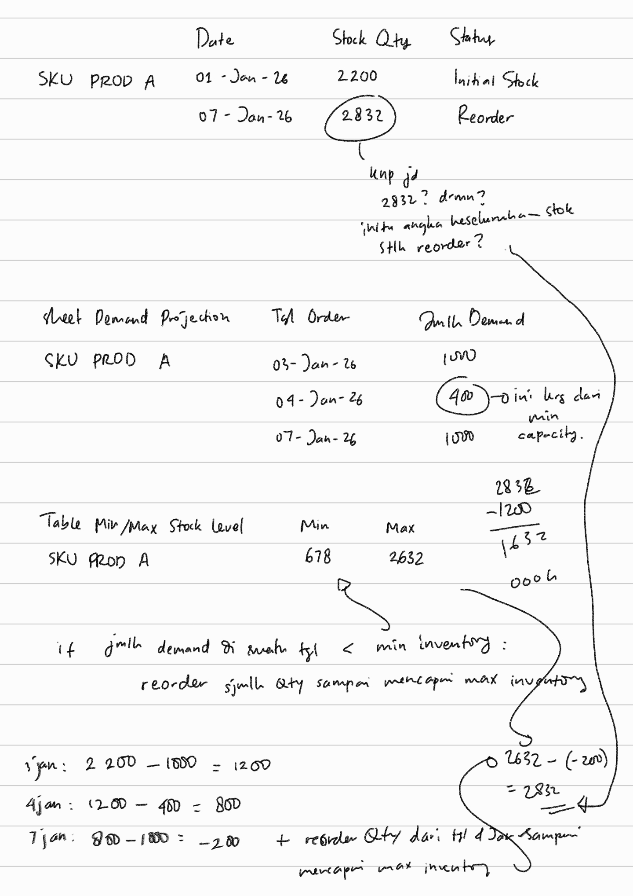
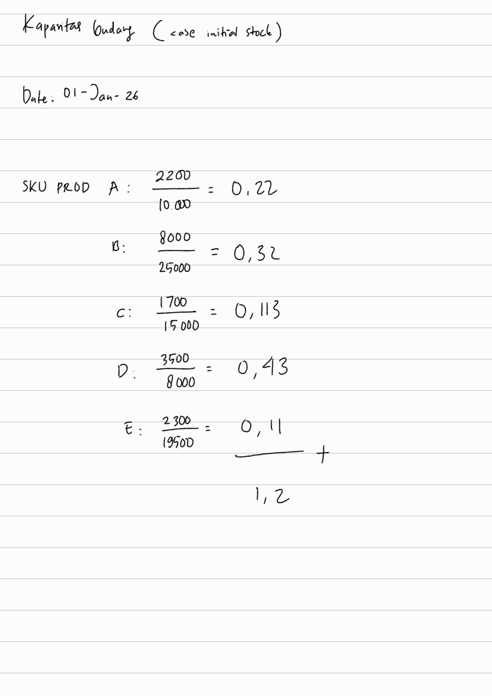

# hackathon-excel-dqlab-2026

## Hackathon Overview

Raw data: 

- **sheet `Demand Projection`:**        
Keterangan:

    - Demand Projection ini sheet yang ditujukan untuk melakukan proyeksi jumlah permintaan di setiap tanggal yang sama seperti data sebelumnya, untuk setiap bulan sampai Desember 2026. 
    - Produknya ada 5 jenis: SKU PROD A, B, C, D, E.
    - Task nya adalah mengisi proyeksi jumlah permintaan di bulan selanjutnya untuk tanggal yang sama seperti bulan sebelumnya, mengikuti rule proyeksi yang ditentukan di instruksi. Isi di kolom Jumlah.
    - Rule proyeksinya:   
    - Nantinya hasil proyeksi ini akan digunakan sebagai basis perhitungan stok minimal dan maksimal yang mungkin di gudang untuk masing-masing SKU, di sheet Capacity. 
    - Yang mana, hasil tersebut juga akan digunakan sebagai basis perhitungan untuk penentuan tanggal reorder produk di sheet Warehouse.

 

- **sheet `Warehouse`:**         
Keterangan:
    - Sheet Warehouse, versi raw dari sana nya terdiri dari 5 kolom: #, Item / SKU, Date, Stock Qty, dan Status. Baris data raw: baris 2 sampai 5, yang mana seluruhnya merupakan data Initial Stock. 
    - Untuk seterusnya, kolom Status isiannya adalah Reorder, yang mana merupakan jumlah kuantitas produk yang perlu direorder sesuai ketentuan.
    - **Ketentuan reorder:** dilakukan jika jumlah order dari kebutuhan / demand pada tanggal tersebut di  bawah angka minimal inventory level dari produk tersebut. Ketika keadaan tersebut terjadi, reorder harus dilakukan dengan jumlah untuk mencapai inventory level maksimal dari produk tersebut. 
    - Kotretan perhitungan kuantitas reorder beserta gambaran terkait kapan persisnya informasi Stock Qty nya diupdate, untuk case SKU PROD A:       
    - Lalu pada sheet ini juga diminta untuk membuat kolom baru: **`Arrival Date`** dan **`Kapasitas Gudang`**.
    - Arrival Date diisi dengan tanggal sampainya barang yang sudah diorder ke gudang. Durasi setiap pengiriman adalah 3 hari terhitung sejak tanggal pada kolom Date pada baris data yang sama.
    - Contoh perhitungan kapasitas gudang, untuk case initial stock:      
    - Rule perhitungan kapasitas gudang: hitung stok SKU Produk A s.d. stok SKU Produk E di gudang  pada tanggal arrival dikurangi demand pada saat arrival, dibandingkan dengan informasi kapasitas gudang yang ada pada sheet Capacity. Lakukan perhitunganya untuk masing-masing SKU dulu, baru setelah angka masing-masingnya sudah ada, jumlahkan, lalu isi untuk masing-masing SKU dengan arrival date yang sama.

 

- **sheet `Capacity`:**    
   
Keterangan:
    - Sheet Capacity terdiri dari dua tabel: Warehouse Capacity dan Min/Max Stock Level.
    - Untuk tabel Warehouse Capacity sudah ditentukan penyelenggara hackathon dari sananya. 
    - Yang perlu dihitung peserta adalah kolom Min dan Max di tabel Min/Max Stock Level untuk setiap SKU.
    - Perhitungannya dilakukan menggunakan jumlah permintaan yang sudah diproyeksikan sebelumnya di sheet Demand Projection.
    - Rule nya, untuk setiap titik data dengan tanggal yang ada di kolom Tanggal Order sheet Demand Projection, hitung total permintaan SKU yang sama selama 6 hari ke depan. 
    - Lalu dari setiap hasil perhitungan total permintaan di setiap tanggal order itu, untuk masing-masing SKU ditentukan nilai max dan min nya, dan nilai itulah yang dimasukkan ke kolom Min dan Max di sheet Capacity, sesuai SKU nya masing-masing. 
    - Rule juga nih, untuk titik data yang ada di tanggal yang datanya ga ada lagi di 6 hari ke depan, jangan diikutkan di max min. 
    - Dalam hal ini, karena data terakhir ada di tanggal 28 Desember 2026, artinya titik data terakhir yang boleh diikutkan ke perhitungan min max adalah titik data yang ada di tanggal sebelum 23 Desember 2026.
    
     

## Thoughts

### Pre Thoughts
Tujuan ikutan hackathon ini:
- Mencicip dunia supply chain, inventory stock. 
- Me-refresh skill excel. 
- Upaya menambah kompetensi untuk peluang opportunity yang akan datang. 

Plan alur berpikir buat nyelesaiin hackathon ini:
- Baca dan pahami pdf task hackathon nya. 
- Pikirkan dulu solusinya secara mandiri sebelum melibatkan AI. 
- Setelah dapat raw sketch dan big picture nya, berangkat ke AI, ngobrol. 
- Aplikasikan rumus excel hasil rundingan dengan AI. 
- Submit.

My subjective random thoughts during hackathon:
- Mengingat rule yang membebaskan peserta untuk menggunakan AI, maka melihat leaderboard jadi kurang apple-to-apple dijadikan tolok ukur untuk membandingkan progres diri buatku. Terlebih saat ini aku lebih memprioritaskan pematangan konsep secara keseluruhan terlebih dahulu, baru kemudian mengejar kecepatan pengerjaan.
- Yang oleh karenanya, leaderboard di hackathon kali ini sejatinya kebanyakannya lebih berfungsi sebagai pembanding seberapa bagus prompt dan seberapa cepat AI yang digunakan peserta. Saat ini aku belum dalam kondisi seperti itu, masih dalam fase memahami dan memaknai.
- Jadi di hackathon ini, fokusnya lebih ke mindset kalau di sini aku berkompetisi terhadap diriku sendiri, dengan caraku sendiri, dengan pace ku sendiri. 

### After Thoughts

*thought after 6th attempt*:

Sooo in the end, the fastest solution in the end is training agent, then?

  

Training agent? Nah nah. This world seems determined to let **s**~~tu~~**peed**~~ity~~ guide humans through a life stripped of color and challenge. The only challenge left is prompting and proofreading, like an artist who’s no longer touch canvas, paints, nor brushes, only guide and see and guide and see.

Berusaha memahami di tengah derasnya arus kecepatan itu, sebenarnya sulit, dan menyesakkan. 

Tapi, meski begitu, aku tetap ingin memahami, aku tetap ingin mengerti, 

dan aku tetap akan berproses. 
